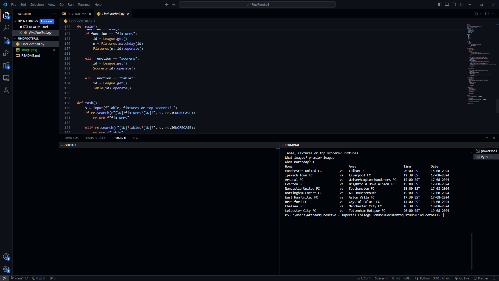

# Find Football - Football Data Retriever

## Overview:

Find Football is a Python-based application that retrieves football data from the football-data.org REST API. It offers three main functionalities: fetching fixtures, league tables, and top scorers for various football leagues.

## How to Use:

### Task Selection:
When you run the program, you will be prompted to select one of the following tasks:
Fixtures
Table
Top Scorers

### League Selection:

After selecting a task, you will be asked to specify the football league for which you want to retrieve data. You can input the league's name (e.g., "Premier League," "Bundesliga") to proceed.

### Additional Inputs:

Depending on the selected task, you may be asked for additional information, such as the matchday for fixtures.

## Demo:

### For a Live Demonstration:
https://youtu.be/LXkZ0VSmFH0

## Data Retrieval:

Find Football uses the football-data.org API to fetch the requested information.

## Display Results:

The retrieved data will be displayed in a structured format, making it easy to read and analyze.
Prerequisites

## Before using Find Football, ensure that you have the following prerequisites installed:

Python 3.x
Required Python libraries (e.g., requests)

## API Authentication:

To use this application, you need to obtain an API token from football-data.org and replace the API_TOKEN variable in the code with your token.

## Available Leagues:

Find Football supports the following football leagues:

Bundesliga
Eredivisie
Campeonato Brasileiro Série A
Primera Division
Ligue 1
Championship
Primeira Liga
Serie A
Premier League
## Running the Application:

To run the Find Football application, execute the main() function from the provided Python script.

## Examples:

Here are some examples of how to use Find Football:

To retrieve Premier League fixtures, select the "Fixtures" task and enter "Premier League" as the league name.
To view the current league table for Serie A, select the "Table" task and enter "Serie A" as the league name.
To find the top scorers in the Bundesliga, select the "Top Scorers" task and enter "Bundesliga" as the league name.

## Contributing:

Contributions to this project are welcome. If you encounter any issues or have suggestions for improvements, please create a GitHub issue or submit a pull request.

## Acknowledgments:

football-data.org for providing the football data API
